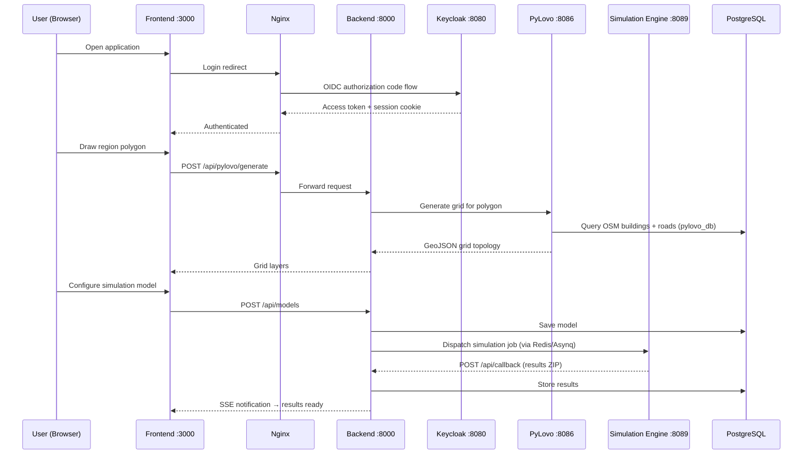
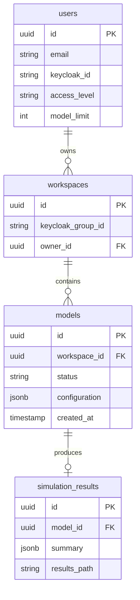
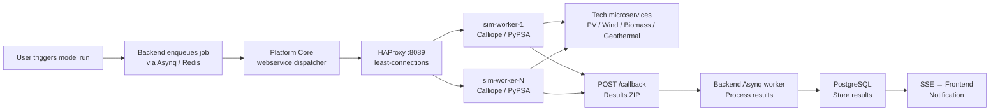

# System Architecture

## Data Flow



## Backend Structure

The Go backend (`enerplanet/backend/`) follows a layered architecture:

```
backend/
├── cmd/main.go              # Entry point
├── internal/
│   ├── handlers/            # HTTP handlers (Gin)
│   ├── services/            # Business logic
│   ├── repositories/        # Database access (GORM)
│   ├── models/              # Domain models
│   ├── middleware/          # Auth, rate-limiting, CORS
│   └── workers/             # Asynq background workers
├── migrations/              # SQL migration files
└── config/                  # Configuration loading
```

Key patterns:
- **Asynq workers** handle long-running tasks (simulation callbacks, notification dispatch) asynchronously via Redis
- **SSE** (Server-Sent Events) pushes real-time status updates to the frontend without polling
- **GORM** with PostgreSQL handles all relational data; PostGIS functions are used directly via raw queries for spatial operations

## Frontend Structure

The React frontend (`enerplanet/frontend/`) is a Vite SPA:

```
frontend/
├── src/
│   ├── components/
│   │   ├── map/             # OpenLayers + MapLibre GL JS map views
│   │   ├── configurator/    # Region selection, building dialog
│   │   ├── simulation/      # Model builder, results viewer
│   │   └── ui/              # Shared UI components
│   ├── services/            # API client functions
│   ├── stores/              # Zustand state slices
│   ├── hooks/               # TanStack Query hooks
│   └── i18n/                # Translation files (8 languages)
└── public/
```

## Database Schema (Key Tables)



The `pylovo_db` database (separate from `spatialai`) holds all grid-related tables: `buildings_result`, `postcode`, `grid_result`, `country`, `state`, `transformer`, etc.

## Simulation Pipeline



Workers are stateless and horizontally scalable. Concurrency per worker is configurable (`MAX_CONCURRENT`).
