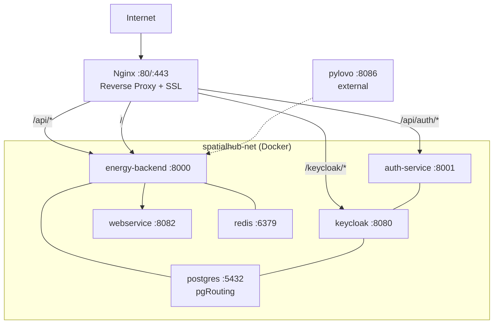
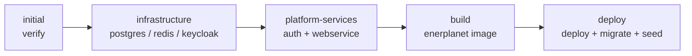

# Deployment

Production deployment uses Docker Compose with Nginx as a reverse proxy.

## Architecture



## Docker Compose Files

### Platform Core (`platform-core/docker-compose.yml`)

```yaml
services:
  postgres:
    image: pgrouting/pgrouting:17-3.5-3.7.3
    container_name: postgres
    restart: unless-stopped
    shm_size: '2gb'
    ports:
      - "5433:5432"
    environment:
      POSTGRES_USER: ${DB_USERNAME:-postgres}
      POSTGRES_PASSWORD: ${DB_PASSWORD:-postgres}
      POSTGRES_DB: ${DB_DATABASE:-spatialai}
    volumes:
      - postgres-data:/var/lib/postgresql/data
    networks:
      - spatialhub-net
    healthcheck:
      test: ["CMD-SHELL", "pg_isready -U ${DB_USERNAME:-postgres}"]
      interval: 10s
      timeout: 5s
      retries: 5

  redis:
    image: redis:7-alpine
    container_name: redis
    restart: unless-stopped
    ports:
      - "6379:6379"
    networks:
      - spatialhub-net

  keycloak:
    image: quay.io/keycloak/keycloak:26.0.6
    container_name: keycloak
    restart: unless-stopped
    ports:
      - "8080:8080"
    environment:
      KC_BOOTSTRAP_ADMIN_USERNAME: ${KEYCLOAK_ADMIN_USER:-admin}
      KC_BOOTSTRAP_ADMIN_PASSWORD: ${KEYCLOAK_ADMIN_PASSWORD:-admin}
      KC_DB: postgres
      KC_DB_URL: jdbc:postgresql://postgres:5432/${DB_DATABASE:-spatialai}
      KC_DB_USERNAME: ${DB_USERNAME:-postgres}
      KC_DB_PASSWORD: ${DB_PASSWORD:-postgres}
      KC_HEALTH_ENABLED: "true"
      KC_HOSTNAME_STRICT: "false"
      KC_HTTP_ENABLED: "true"
    command: start-dev
    depends_on:
      postgres:
        condition: service_healthy
    networks:
      - spatialhub-net

networks:
  spatialhub-net:
    name: spatialhub-net
    external: true
```

### Enerplanet Application (`enerplanet/docker-compose.yml`)

```yaml
services:
  energy-backend:
    image: ${APP_IMAGE:-enerplanet:latest}
    container_name: energy-backend
    restart: unless-stopped
    env_file:
      - ./backend/.env
    environment:
      DB_HOST: postgres
      DB_PORT: 5432
      REDIS_HOST: redis
      KEYCLOAK_URL: http://keycloak:8080
      AUTH_SERVICE_URL: http://auth-service:8001
      WEBSERVICE_SERVICE_URL: http://webservice:8082
    networks:
      - spatialhub-net

  nginx:
    image: nginx:alpine
    container_name: nginx
    restart: unless-stopped
    ports:
      - "80:80"
      - "443:443"
    volumes:
      - ../nginx/conf.d:/etc/nginx/conf.d:ro
      - ../nginx/ssl:/etc/letsencrypt:ro
    depends_on:
      - energy-backend
    networks:
      - spatialhub-net

networks:
  spatialhub-net:
    external: true
```

## Nginx Configuration

`nginx/conf.d/enerplanet.conf`:

```nginx
resolver 127.0.0.11 valid=30s ipv6=off;

server {
    listen 80;
    server_name enerplanet.example.com;

    location /.well-known/acme-challenge/ {
        root /var/www/certbot;
    }

    # Auth endpoints → auth-service
    location ~ ^/api/(login|register|logout|callback-auth|csrf-token|auth/) {
        set $auth_upstream http://auth-service:8001;
        proxy_pass $auth_upstream;
        proxy_set_header Host $host;
        proxy_set_header X-Real-IP $remote_addr;
        proxy_set_header X-Forwarded-For $proxy_add_x_forwarded_for;
        proxy_set_header X-Forwarded-Proto $scheme;
        proxy_pass_header Set-Cookie;
    }

    # Keycloak
    location /keycloak/ {
        set $keycloak_upstream http://keycloak:8080;
        proxy_pass $keycloak_upstream;
        proxy_set_header Host $host;
        proxy_buffer_size 128k;
        proxy_buffers 4 256k;
    }

    # Backend API
    location /api/ {
        set $backend_upstream http://energy-backend:8000;
        proxy_pass $backend_upstream;
        proxy_set_header Host $host;
        proxy_set_header X-Real-IP $remote_addr;
        proxy_read_timeout 300;
    }

    # Frontend SPA
    location / {
        set $backend_upstream http://energy-backend:8000;
        proxy_pass $backend_upstream;
        proxy_set_header Upgrade $http_upgrade;
        proxy_set_header Connection 'upgrade';
        proxy_cache_bypass $http_upgrade;
    }
}
```

## CI/CD

!!! note "GitLab CI/CD"
    The included `.gitlab-ci.yml` targets a self-hosted GitLab instance. If you are deploying from GitHub, replace it with a GitHub Actions workflow — the five-stage structure maps directly to `jobs:` in a `.github/workflows/deploy.yml`.

The pipeline has five stages:



All deployment stages are **manual** (triggered from GitLab UI) except `initial:verify` which runs automatically.

### Required CI/CD Variables

| Variable | Description |
|---|---|
| `DEPLOY_SERVER_HOST` | SSH hostname of the deploy server |
| `DEPLOY_SERVER_USER` | SSH username |
| `SSH_PRIVATE_KEY` | Base64-encoded SSH private key |
| `REPO_ACCESS_TOKEN` | GitLab token for cross-project access |

## Production Environment Variables

```bash
DB_HOST=postgres
DB_PORT=5432
DB_DATABASE=spatialai
DB_USERNAME=postgres
DB_PASSWORD=<secure-password>
REDIS_HOST=redis
REDIS_PORT=6379
KEYCLOAK_URL=http://keycloak:8080
KEYCLOAK_REALM=spatialhub
KEYCLOAK_CLIENT_ID=spatialhub
KEYCLOAK_CLIENT_SECRET=
AUTH_SERVICE_URL=http://auth-service:8001
WEBSERVICE_SERVICE_URL=http://webservice:8082
PYLOVO_SERVICE_URL=http://<pylovo-host>:8086
APP_ENV=production
APP_URL=https://enerplanet.example.com
RATE_LIMIT_PER_MIN=1000
```

## SSL with Let's Encrypt

```bash
sudo apt install certbot
sudo certbot certonly --webroot \
  -w /path/to/nginx/certbot \
  -d enerplanet.example.com

# Auto-renewal (crontab)
0 0 * * * certbot renew --quiet
```

## Health Checks

```bash
# Service health
curl -s https://enerplanet.example.com/api/health
curl -s https://enerplanet.example.com/api/auth/health

# Container status
docker compose ps                          # in platform-core/
docker compose ps                          # in enerplanet/

# Logs
docker logs energy-backend -f --tail 100
docker logs keycloak -f --tail 100
docker stats --no-stream
```
