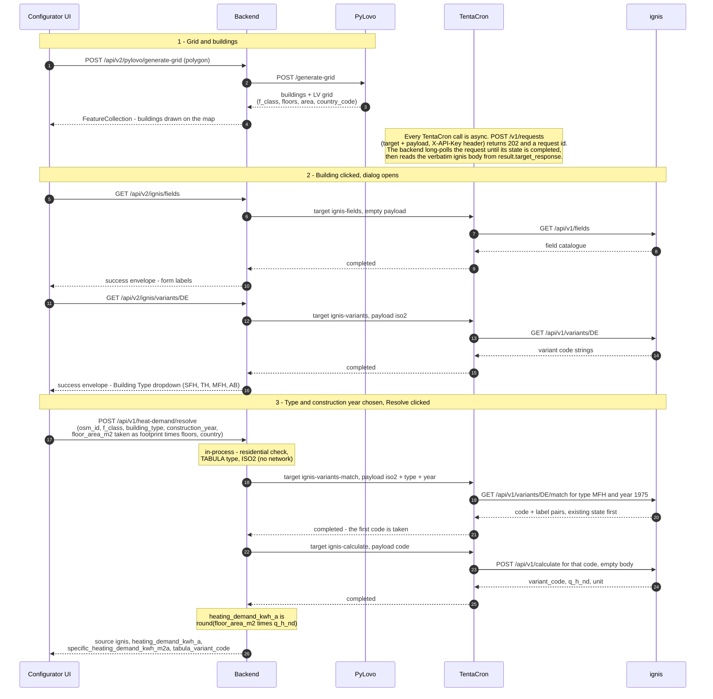

# Heat Demand Resolution

The backend resolves a building's annual space-heating demand from TABULA
building-typology data served by ignis. Every ignis call is routed through the
TentaCron orchestrator; the backend holds no ignis address of its own.

This page covers the request path from a generated grid to a resolved figure
in the building dialog.

## Participants

| Component | Role |
|---|---|
| Configurator UI | React building dialog on `:3000` |
| Backend | Go / Gin on `:8000` |
| PyLovo | LV-grid service on `:8086` |
| TentaCron | Orchestrator on `:8092` |
| ignis | TABULA / EN ISO 13790 heat-demand service |

## Request flow

The sequence below shows grid creation, the two lookups fired when the dialog
opens, and the two ignis calls made on resolve.

## Notes

- **Two ignis calls per resolve**: `ignis-variants-match` then `ignis-calculate`.
  `ignis-fields` and `ignis-variants` fire once when the dialog first opens and
  are cached per country on the frontend.
- **The browser makes one call per user action.** The 202 + long-poll runs
  entirely between the backend and TentaCron on the internal network.
- **Routing logic stays in the backend.** The residential classifier, the
  TABULA-type mapping, the by-code dedup, and the U-value attach used by
  `run_buem` all run in-process. TentaCron performs only the configured call.
- **Fallback.** A non-residential class, a missing construction year, no
  matching archetype, or an ignis error falls back to the usage-class estimate:
  `source: "estimate"` with a `warnings` entry naming the reason.
- **ignis 4xx** returns as a TentaCron `target_error`; the backend unwraps
  ignis's own message and treats it as a miss.

!!! note "Scope"
    Only ignis is routed through TentaCron. buem-gateway, City2TABULA and weather are still called directly by the
    backend. Moving them behind TentaCron is planned as later increments.
