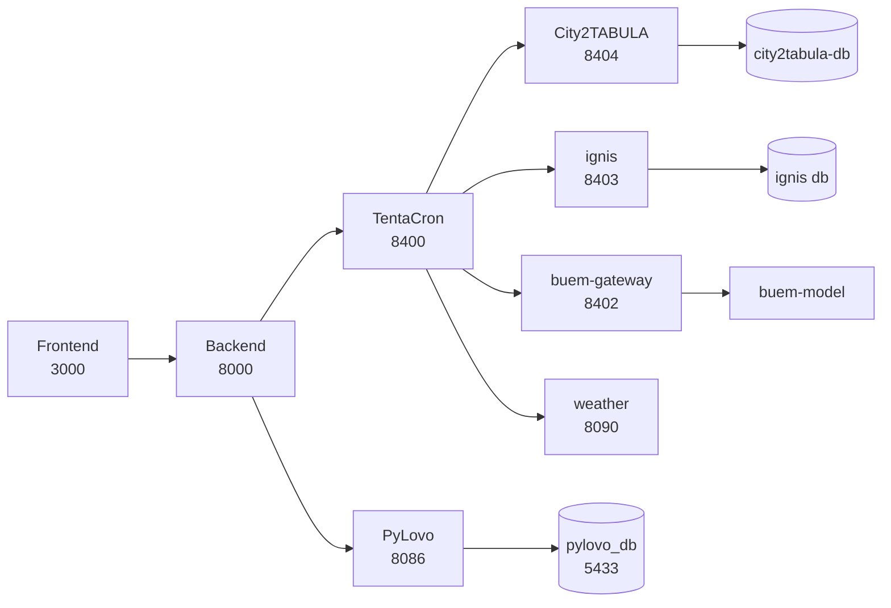

# Running the heat stack end to end

[Installation](installation.md) brings up the platform: backend, frontend,
Keycloak, PyLovo. This page covers the six further services the heat workflow
needs, and how to get from a fresh checkout to a building rendered in 3D with a
BuEM load profile behind it.

Everything here assumes the fixtures from [Test Data](test-data.md) are loaded.

## What talks to what

The backend never calls a heat service directly. TentaCron proxies every one of
them, holds their API keys and applies per-target retry and response limits.



| Service | Port | Reached by | Holds |
|---|---|---|---|
| TentaCron | 8400 | the backend | the proxy targets and their keys |
| meme | 8401 | TentaCron | not wired into the heat path |
| buem-gateway | 8402 | TentaCron | the BuEM JSON Schema contract |
| ignis | 8403 | TentaCron | EN ISO 13790, TABULA archetypes |
| City2TABULA | 8404 | TentaCron | 3D envelopes, one database per country |
| weather | 8090 | TentaCron | COSMO-REA6 archives |

Ports come from `repos.conf`, which is also where [Test Data](test-data.md)
takes its table from.

!!! warning "weather is allocated one port and looked up on another"
    `repos.conf` sets `WEATHER_PORT=8406`, and TentaCron's `config.yaml` reaches
    weather at `host.docker.internal:8090`. The two have to agree or the target
    resolves to nothing, and `make weather` uses the `repos.conf` value, so the
    documented command produces a stack where TentaCron cannot reach weather.

    The table above gives 8090 because that is the value TentaCron reads, and
    TentaCron is the only caller. Until the two are reconciled, whichever port
    weather is started on must match `config.yaml`, not `repos.conf`.

## Bring-up

```bash
docker network create building-simulation_default   # City2TABULA declares it external
docker network create tentacron-net
make ignis
make city2tabula
make buem
make tentacron
make dev-bg                                          # backend + frontend on the host
```

!!! warning "Four of these need working around"
    `make tentacron-stack` runs the lot in order and stops at the first
    failure, so it never reaches the end. Each target below fails for its own
    reason; the working command follows.

**`make tentacron`** targets a compose service named `api`, which does not
exist. The service is `tentacron`:

```bash
cd dependencies/TentaCron/environment
make build ENV=dev
HOST_PORT=8400 docker compose --env-file .env.dev -f docker-compose.yml up -d tentacron
docker network connect tentacron-net tentacron-env-tentacron-1
```

**`make weather`** reads `../TentaCron/environment/.env.dev` relative to the
weather checkout. `dependencies/*` are symlinks, so the shell resolves `..`
physically into the target's parent and the file is not there. Pass an absolute
path, and use port 8090 to match TentaCron's target:

```bash
cd dependencies/weather
set -a && . /abs/path/to/enerplanet/dependencies/TentaCron/environment/.env.dev && set +a
unset COMPOSE_PROJECT_NAME PORT HOST_PORT CONFIG IMAGE_TAG RELEASE_IMAGE
WEATHER_API_KEYS="$WEATHER_API_KEY" WEATHER_API_PORT=8090 \
  docker compose -f infrastructure/container/docker-compose.serve.yml up -d --build
docker network connect tentacron-net weather-serve
```

**`make city2tabula`** fails with a `container_name` conflict when another tree
already runs `city2tabula-db`. Three checkouts declare a compose file for that
service and two use the same container name, with bind mounts relative to their
own directory, so which code is served depends on where the container was last
started from. Start only the server against the database already running:

```bash
cd dependencies/city2tabula/environment/http
C2T_SERVER_HOST_PORT=8404 docker compose --env-file docker.env -f docker-compose.yml \
  up -d --no-deps city2tabula-server
docker network connect <the db's network> city2tabula-server
```

Confirm which tree a running service serves before trusting a code change:

```bash
docker inspect pylovo-api-dev --format '{{range .Mounts}}{{.Source}}{{"\n"}}{{end}}'
```

## Load the fixtures

```bash
make fixtures
```

The loader skips anything already present, which is what you want on a second
run and not what you want after regenerating a fixture. Drop the target first
in that case; see [Test Data](test-data.md) for what each file populates and
which database it lands in.

`C2T_DB_NAME` decides which databases City2TABULA derives per country, and both
the loader and the server must agree on it. With the default, the server reads
`city2tabula_nl` and `city2tabula_de`.

## Verify

The smoke test is the backend half, and it covers both regions:

```bash
cd enerplanet/backend
SMOKE_SITE=loenen ./scripts/smoke/heat_workflow_smoke.sh
SMOKE_SITE=bremen ./scripts/smoke/heat_workflow_smoke.sh
```

Both should report `0 failure(s)`. A failure here is a backend or fixture
problem, never a UI one, which is the point of running it first.

Then, in the frontend:

1. **Go to region** lists Bremen and Gelderland, grouped by country. Pick one
   and the map flies to the extent that has data.
2. Draw a polygon inside it. Grid generation and power flow run, and the heat
   technologies prompt appears once demand is assigned.
3. Click a building. Its envelope renders in 3D, with the load profile above
   and its parameters beside it.
4. Click a surface. Its editor opens with the area, U-value, orientation and
   tilt resolved from the building's TABULA archetype.
5. **Run simulation**. BuEM returns hourly profiles, aggregated to the view's
   selected resolution.

## Gotchas

**The rate limit differs by how the backend starts.** `docker-compose.yml` sets
`RATE_LIMIT_PER_MIN: 1000`; a host run reads `backend/.env`. Without that line
it falls back to the 100 in `internal/middleware/rate_limit.go`, which the
configurator exhausts in a few building selections. The limit counts per client
IP, so everything on the host shares one bucket.

**The region list serves one stale read after PyLovo data changes.** The
endpoint answers from a cache and refreshes in the background, so the first
call returns the previous answer. Read it twice.

**A fixture-loaded City2TABULA database serves reads but cannot run the
pipeline.** The raw CityGML import schemas are excluded, so a triggered
extraction fails with a message naming the missing schemas. Nothing in the
workflow above needs one.

**Bremen has no PyLovo LiDAR heights**, so its region carries no 3D badge in the
region list. That flag reports `buildings_result.height_median`, which is
unrelated to the CityGML envelopes the heat workflow actually uses.
