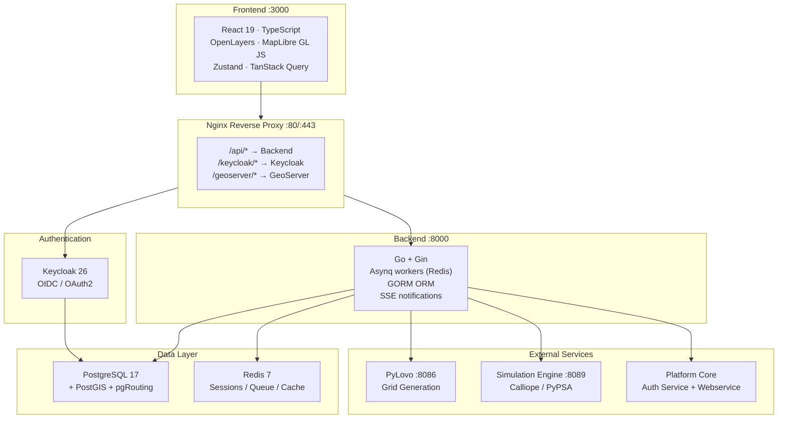

# EnerPlanET Platform

EnerPlanET is a full-stack web application for community energy grid planning. It combines geospatial data, building enrichment pipelines, synthetic grid generation (PyLovo), and energy system optimisation (Calliope/PyPSA) in a single platform.

## Architecture

## Service Port Reference

| Service | Port | Description |
|---|---|---|
| Frontend (dev) | 3000 | React + Vite dev server |
| Backend API | 8000 | Go + Gin REST API |
| Keycloak | 8080 | OAuth2/OIDC identity management |
| Auth Service | 8001 | Login/logout/session handling |
| Webservice | 8082 | Simulation worker management |
| PyLovo | 8086 | Synthetic grid generation (HAProxy) |
| Simulation Engine | 8089 | Calliope/PyPSA workers (HAProxy) |
| PostgreSQL | 5433 | Primary database |
| Redis | 6379 | Sessions, queue, cache |

## Technology Stack

**Frontend** — React 19, TypeScript 5.8, Vite 7, TailwindCSS 4, Radix UI, TanStack Query 5, Zustand 5, OpenLayers 10, MapLibre GL JS, ECharts 6

**Backend** — Go 1.24, Gin, GORM, Asynq (Redis-backed), SSE for real-time notifications

**Grid Engine (PyLovo)** — Python 3.10, FastAPI, HAProxy (3 workers), PostGIS + pgRouting, Redis LRU cache

**Simulation** — Go webservice + HAProxy (N scalable workers), Calliope 0.6.10, PyPSA, NREL PySAM tech microservices

**Infrastructure** — PostgreSQL 17 + PostGIS 3.5, Keycloak 26, Redis 7, Nginx, Docker Compose

## Shared Libraries

The `libs/` workspace contains shared npm packages used by the frontend:

| Package | Purpose |
|---|---|
| `@spatialhub/ui` | Radix-based component library |
| `@spatialhub/auth` | Authentication flows |
| `@spatialhub/forms` | Form components with validation |
| `@spatialhub/i18n` | i18next multi-language support |
