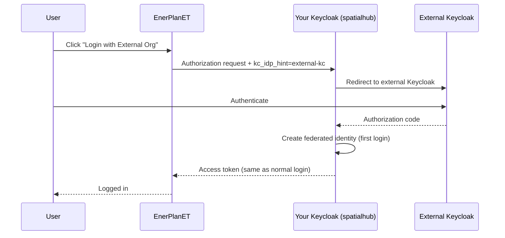

# Keycloak Identity Brokering

This guide explains how to allow users from an external Keycloak instance to log into EnerPlanET without modifying application code.

## Approach Options

| Option | Code Changes | Complexity |
|---|---|---|
| **A: Identity Brokering** (recommended) | None | Low — Keycloak admin only |
| B: Multi-realm token validation | Backend + auth-service | High |
| C: Custom Keycloak SPI | Java SPI development | Very high |

This guide covers **Option A**. With identity brokering, your Keycloak acts as a broker that delegates authentication to the external Keycloak.

## How It Works



No changes are required in auth-service, the backend, or the frontend.

## Step 1: Collect External Keycloak Details

From the external Keycloak admin, you need:

- External Keycloak URL (e.g. `https://external-keycloak.example.com`)
- External realm name
- A client ID and secret created on the external Keycloak for this integration

On the **external** Keycloak, create a client:

- **Client ID**: `spatialhub-broker` (or any name)
- **Access Type**: `confidential`
- **Valid Redirect URIs**: `https://<YOUR-KC-HOST>/realms/spatialhub/broker/external-kc/endpoint`
- Note the client secret from the Credentials tab

## Step 2: Add Identity Provider in Your Keycloak

1. Log in to your Keycloak Admin Console
2. Select realm **`spatialhub`**
3. Navigate to **Identity Providers** → **Add provider** → **Keycloak OpenID Connect**
4. Fill in:

   | Field | Value |
   |---|---|
   | Alias | `external-kc` |
   | Display Name | `External Organisation Login` |
   | Trust Email | ON (if external KC verifies emails) |
   | First Login Flow | `first broker login` |

5. Under **OpenID Connect Settings**, use the discovery URL to auto-fill endpoints:
   ```
   https://<EXTERNAL-KC-URL>/realms/<EXTERNAL-REALM>/.well-known/openid-configuration
   ```
   Set **Client ID** and **Client Secret** to the values from Step 1.

6. Save.

## Step 3: Sync User Attributes

In the IdP **Mappers** tab, add these attribute importers:

| Mapper Name | Claim | User Attribute |
|---|---|---|
| email | `email` | `email` |
| firstName | `given_name` | `firstName` |
| lastName | `family_name` | `lastName` |

To assign a default access level to external users, add a **Hardcoded Attribute** mapper:

| Field | Value |
|---|---|
| Mapper Type | Hardcoded Attribute |
| User Attribute | `access_level` |
| Attribute Value | `very_low` (or the desired default) |

## Step 4: Configure First Login Flow

Navigate to **Authentication → Flows → first broker login**.

- Set **Review Profile** to `REQUIRED` — lets external users confirm their details on first login
- Or `DISABLED` for fully seamless SSO

## Step 5: Seamless Redirect (Skip Keycloak Login Page)

To bypass the Keycloak login page and redirect directly to the external IdP, use the `kc_idp_hint` parameter in the authorization URL:

```
https://<YOUR-KC-HOST>/realms/spatialhub/protocol/openid-connect/auth
  ?client_id=spatialhub
  &redirect_uri=https://<APP-HOST>/callback-auth
  &response_type=code
  &scope=openid
  &kc_idp_hint=external-kc
```

Add a dedicated **"Login with External Organisation"** button in the frontend that constructs this URL.

## Verification

1. Open the app login page and click the external login button
2. Authenticate on the external Keycloak
3. Confirm you are redirected back to the app
4. In Keycloak Admin → Users, verify the federated user appears with **Identity Provider Links** showing `external-kc`

## Troubleshooting

**External login button doesn't appear**
: Ensure the IdP is enabled: Identity Providers → external-kc → Enabled: ON

**Invalid redirect URI**
: Add `https://<YOUR-KC-HOST>/realms/spatialhub/broker/external-kc/endpoint` to the Valid Redirect URIs on the external Keycloak client

**External user has no access to features**
: The `access_level` attribute is not set. Add a Hardcoded Attribute mapper on the IdP (see Step 3)

**User appears to be a duplicate**
: Expected with identity brokering. Configure **Detect Existing User** in the first broker login flow to link accounts by email instead of creating new ones

**CORS errors**
: Not applicable — the browser communicates directly with the external Keycloak during the login redirect; your backend never contacts it
