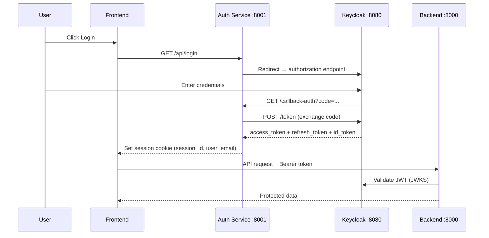

# Authentication (Keycloak)

EnerPlanET uses Keycloak 26 for authentication and authorisation via OpenID Connect (OIDC).

## Authentication Flow



## Role and Access Level Model

Enerplanet uses Keycloak user **attributes** (not roles) to control model limits:

| Access Level | Model Limit |
|---|---|
| `very_low` | 10 |
| `intermediate` | 25 |
| `manager` | 50 |
| `expert` | Unlimited |

A custom `model_limit` attribute overrides the default for the assigned level.

## Workspace Mapping

Keycloak **groups** map directly to Enerplanet **workspaces**. When a manager account is created, a default group `Default_{user_id}` is auto-created.

| Keycloak Group Attribute | Purpose |
|---|---|
| `owner_email` | Workspace owner identification |
| `owner_name` | Display name |
| `display_name` | Workspace label in UI |
| `disabled` | Suspend workspace access |

## Keycloak Setup

### Realm

!!! warning "Change default admin credentials"
    Keycloak ships with `admin` / `admin`. Change these immediately in production via
    `KC_BOOTSTRAP_ADMIN_USERNAME` and `KC_BOOTSTRAP_ADMIN_PASSWORD` environment variables.

1. Access Keycloak Admin Console at `http://localhost:8080`
2. Log in (development default: `admin` / `admin`)
3. Create realm: **`spatialhub`**
4. Enable: User Registration, Email as Username, Login with Email, Remember Me

### Client

1. Clients → Create Client
2. **Client ID**: `spatialhub`
3. **Protocol**: `openid-connect`
4. **Access Type**: `confidential`
5. **Valid Redirect URIs**: `http://localhost:3000/*`, `http://localhost:8000/*`
6. **Web Origins**: `http://localhost:3000`, `http://localhost:8000`
7. Copy the generated secret from the **Credentials** tab

### Application Roles

Create these roles under Clients → spatialhub → Roles:

| Role | Access |
|---|---|
| `admin` | Full platform access, user management |
| `expert` | Create/edit models, run simulations |
| `viewer` | Read-only access to shared models |

### User Attributes

Set these on individual users under Users → Attributes:

```yaml
access_level: expert       # or very_low, intermediate, manager
model_limit: 100           # optional override
preferred_language: en
organization: THD
```

## Environment Variables

**Backend (`enerplanet/backend/.env`)**:
```bash
KEYCLOAK_URL=http://localhost:8080
KEYCLOAK_REALM=spatialhub
KEYCLOAK_CLIENT_ID=spatialhub
KEYCLOAK_CLIENT_SECRET=
```

**Auth Service (`platform-core/auth-service/.env`)**:

!!! warning
    Replace `admin` / `admin` with strong credentials before deployment.

```bash
KEYCLOAK_ADMIN_USER=admin
KEYCLOAK_ADMIN_PASSWORD=admin
KEYCLOAK_URL=http://localhost:8080
KEYCLOAK_REALM=spatialhub
KEYCLOAK_CLIENT_ID=spatialhub
KEYCLOAK_CLIENT_SECRET=
```

**Frontend (`enerplanet/frontend/.env`)**:
```bash
VITE_KEYCLOAK_URL=http://localhost:8080
VITE_KEYCLOAK_REALM=spatialhub
VITE_KEYCLOAK_CLIENT_ID=spatialhub
```

## Production Notes

- Set **SSL Required** to `all` in realm settings when running over HTTPS
- Update all redirect URIs to use `https://`
- The `keycloak-init` container (in `platform-core/docker-compose.yml`) automates realm configuration and injects client secrets into service `.env` files on first run

## Troubleshooting

**Token validation fails**
```bash
curl http://localhost:8080/health
curl http://localhost:8080/realms/spatialhub
```

**Invalid redirect URI** — Add the exact origin to Valid Redirect URIs in client settings.

**CORS errors** — Add the frontend origin to Web Origins in client settings.
