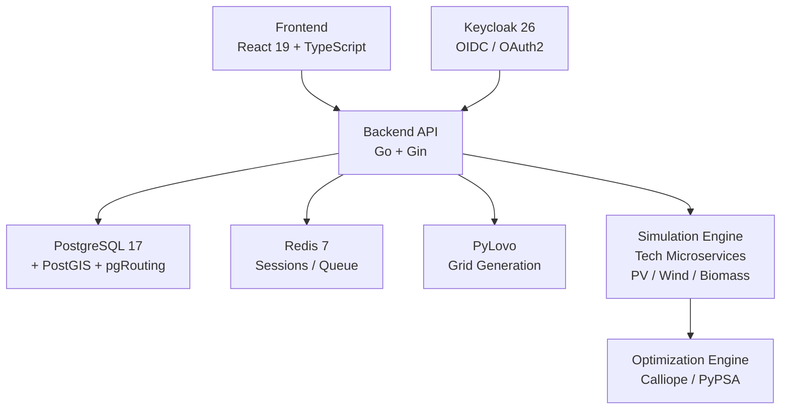

# EnerPlanET

EnerPlanET is an open-source platform for designing, simulating, and optimising local energy distribution networks. It supports data-driven community energy planning — from polygon-based region selection and synthetic grid generation to power-flow simulation and cost analysis.

## Platform Components

## Key Capabilities

| Capability | Description |
|---|---|
| Interactive Mapping | 2D (OpenLayers) and 3D (MapLibre GL JS) building visualisation |
| Grid Generation | Synthetic LV network design from OSM building footprints via PyLovo |
| Energy Simulation | Calliope and PyPSA optimisation via scalable simulation workers |
| Building Enrichment | 3D BAG, EP-Online, CBS (Netherlands); EUBUCCO (Germany); extensible |
| Technology Modelling | PV, wind, battery, biomass, geothermal |
| Cost Analysis | Cable, transformer, and equipment cost estimation |
| Multi-language | 8 languages: EN, DE, NL, ES, FR, IT, CS, PL |

## Documentation Sections

- **[EnerPlanET Platform](enerplanet/index.md)** — Installation, architecture, deployment, and Keycloak setup
- **[PyLovo Grid Engine](pylovo/index.md)** — Quickstart, algorithms, building types, AI energy estimation, REST API
- **[Simulation Webservice](webservice/index.md)** — Energy technology modelling and simulation endpoints
- **[Open Source Checklist](getting-started/open-source-checklist.md)** — Requirements for publishing and maintaining open-source code.
