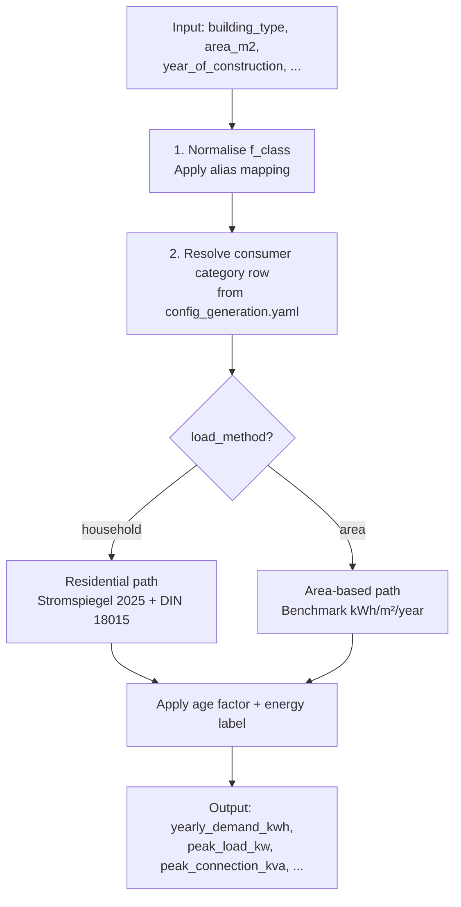

# AI Energy Estimation

!!! note
    Despite the "AI estimation" label, the current implementation is a **rule-based estimator** grounded in German energy benchmarks (Stromspiegel 2025, BDEW SLPs, DIN 18015-1). The term reflects its origin in the research pipeline.

## Overview

The estimator is in `src/ai_estimation/estimator.py` and exposed via:

- Python: `BuildingEnergyEstimator.estimate()`
- REST API: `POST /estimate-energy` and `POST /estimate-energy-batch`

For each building it returns annual electricity demand, peak load, and a breakdown of which assumptions were applied.

## Estimation Flow



## Residential Path

### Single vs. Multi-Dwelling

A building is treated as multi-dwelling if it is apartment-like (e.g. `apartments`) **or** if total area ≥ 300 m², or per-floor area suggests multiple units.

### Annual Demand

$$Y = Y_{household} \times f_{area} \times f_{age} \times f_{label}$$

Where:
- `Y_household` — Stromspiegel 2025 benchmark for the household size (house or apartment table)
- `f_area = clamp(r^{0.15}, 0.70, 1.35)`, with `r = area / reference_area`
- `f_age` — age multiplier from construction year (see table below)
- `f_label` — Stromspiegel A–G energy label scaling (relative to class D = 1.0)

### Peak Load (Multi-Dwelling)

$$P = P_{base} \times f_{hh\_peak} \times n_{units}^{0.55} \times f_{age\_peak}$$

`peak_connection_kva` uses the DIN 18015 table with interpolation.

### Residential Age Multipliers

| Construction Year | Annual Factor | Peak Factor |
|---|---|---|
| < 1945 | 1.22 | 1.14 |
| 1945–1978 | 1.16 | 1.11 |
| 1979–1983 | 1.11 | 1.07 |
| 1984–1994 | 1.08 | 1.06 |
| 1995–2001 | 1.04 | 1.03 |
| 2002–2009 | 1.00 | 1.00 |
| 2010–2015 | 0.95 | 0.97 |
| 2016+ | 0.90 | 0.94 |

Baseline is EnEV-2002 era. If `renovation_year ≥ 2002` is provided, it overrides `year_of_construction` for age factor selection.

### Energy Label Factors (Stromspiegel A–G)

Applied only to residential buildings. Label D = 1.0 (reference). Labels A–C reduce demand; E–G increase it. Separate tables for houses vs. apartments and with/without electric hot water.

### Household Reference Areas

| Household Size | Apartment Ref. (m²) | House Ref. (m²) | Peak Factor |
|---|---|---|---|
| 1 | 45 | 90 | 0.80 |
| 2 | 65 | 115 | 1.00 |
| 3 | 80 | 140 | 1.10 |
| 4 | 100 | 160 | 1.20 |
| 5 | 120 | 190 | 1.30 |

## Area-Based Path (Non-Residential)

$$Y = A \times \text{specific\_kwh\_m2} \times f_{age}$$

Specific electricity benchmarks (selected examples):

| f_class | kWh/m²/year | Peak W/m² | Full Load Hours |
|---|---|---|---|
| `office` | 35 | 13 | 2 676 |
| `supermarket` | 200 | 50 | 4 500 |
| `restaurant` | 95 | 80 | 2 000 |
| `school` | 21 | 10 | 2 066 |
| `hospital` | 100 | 65 | 5 000 |
| `warehouse` | 30 | 15 | 1 500 |
| `factory` | 100 | 80 | 3 500 |
| `greenhouse` | 80 | 40 | 4 500 |
| `data_center` | 1 000 | — | 7 500 |

## Input Parameters

| Parameter | Type | Required | Description |
|---|---|---|---|
| `building_type` | str | Yes | OSM f_class (e.g. `office`, `apartments`) |
| `area_m2` | float | Yes | Gross floor area (minimum 1.0 m²) |
| `year_of_construction` | int | No | For residential age multipliers |
| `household_size` | int | No | Override residential household size (1–5) |
| `num_floors` | int | No | Helps infer multi-dwelling behaviour |
| `energy_label` | str | No | Stromspiegel class A–G (residential only) |
| `hot_water_electric` | bool | No | Use electric hot water benchmark table |
| `renovation_year` | int | No | Python API only; overrides age baseline if ≥ 2002 |

## Output Fields

| Field | Description |
|---|---|
| `yearly_demand_kwh` | Annual electricity demand |
| `peak_load_kw` | Operational peak load |
| `peak_connection_kva` | DIN 18015 connection peak (residential) |
| `specific_demand_kwh_m2` | Annual demand per m² |
| `f_class` | Normalised building type used |
| `parent_category` | Inferred category (residential / commercial / …) |
| `household_size_used` | Final residential household size |
| `estimated_households_used` | Estimated dwelling units (multi-household) |
| `energy_label_used` | Accepted label A–G or null |
| `age_factor_applied` | Annual demand age multiplier |
| `age_factor_peak_applied` | Peak-load age multiplier |
| `source` | Estimator version identifier |

## REST API

**Single building:**

```bash
curl -X POST http://localhost:8086/estimate-energy \
  -H "Content-Type: application/json" \
  -d '{
    "building_type": "apartments",
    "area_m2": 600,
    "year_of_construction": 1998,
    "num_floors": 4,
    "energy_label": "C",
    "hot_water_electric": false
  }'
```

**Batch:**

```bash
curl -X POST http://localhost:8086/estimate-energy-batch \
  -H "Content-Type: application/json" \
  -d '{
    "buildings": [
      {"building_type": "office", "area_m2": 500, "year_of_construction": 2015},
      {"building_type": "house", "area_m2": 140, "energy_label": "D"},
      {"building_type": "supermarket", "area_m2": 900}
    ]
  }'
```

## References

- [Stromspiegel 2025](https://www.stromspiegel.de/stromverbrauch-verstehen/stromverbrauch-im-haushalt/) — Household electricity benchmarks
- [BDEW Standard Load Profiles](https://www.bdew.de) — Sector-level references
- DIN 18015-1 — Residential peak load and connection sizing
- [CIBSE TM46](https://www.cibse.org/knowledge-research/knowledge-portal/tm46-energy-benchmarks/) — Non-residential benchmarks
