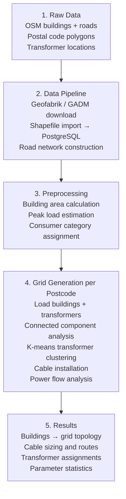

# PyLovo Architecture

## Project Structure

```
pylovo/
├── src/
│   ├── grid_generator.py         # Main orchestrator
│   ├── cable_installer.py        # Cable routing and sizing
│   ├── parameter_calculator.py   # Grid parameter analysis
│   ├── ev_hosting.py             # EV hosting capacity
│   ├── database/
│   │   ├── database_client.py    # Main client (mixin-based)
│   │   ├── connection_pool.py
│   │   ├── preprocessing_mixin.py
│   │   ├── clustering_mixin.py
│   │   ├── grid_mixin.py
│   │   └── analysis_mixin.py
│   ├── classification/           # Representative grid clustering
│   ├── ai_estimation/            # Energy demand estimation
│   └── electrical_backend/       # Power flow backends (Pandapower / OpenDSS)
├── api/
│   ├── main.py                   # FastAPI entry point
│   ├── models/                   # Pydantic request/response models
│   ├── routers/                  # Route handlers
│   └── services/                 # Business logic
├── config/
│   ├── config_generation.yaml
│   ├── config_database.yaml
│   └── config_table_structure.py
├── datapipeline/                 # OSM data acquisition
└── runme/                        # CLI entry points
```

## Data Flow



## Core Algorithms

### Transformer Placement (K-means)

For postcodes with many buildings, transformers are placed using k-means clustering:

1. Filter buildings with `peak_load > 0`
2. For components with >2000 buildings: `k = component_size / 1000`
3. Run k-means on building centroids to determine transformer positions
4. Snap to nearest brownfield transformer location if available
5. Small components (<= 2000 buildings): one transformer per component

### Simultaneity Calculation (Kerber Formula)

Simultaneous load accounts for the statistical diversity of consumer demand:

$$P_{sim} = P_{peak} \times \left( g + (1 - g) \times n^{-3/4} \right)$$

Where `n` is the number of loads and `g` is the category simultaneity factor (0.07 – 0.60).

### Cable Selection

For each cable segment:
1. Calculate required current: `I = P_sim / (V × √3)`
2. Select the smallest cable meeting the current capacity
3. Check voltage drop: `ΔV = I × (R·cosφ + X·sinφ) × L`
4. If `ΔV` exceeds the limit, select a larger cable and repeat

Voltage drop limits:
- Small loads (≤ 100 kW): 0.05 % per km
- Large loads (> 100 kW): 0.1 % per km
- Maximum distribution limit: 4.5 % total

### Cable Routing

Building-to-transformer cable routes follow the road network using `pgr_dijkstra` (pgRouting), avoiding obstacles rather than routing as-the-crow-flies.

## Electrical Backend

The power flow engine uses an abstract interface, allowing different backends:

```python
class IElectricalBackend(ABC):
    @abstractmethod
    def create_network(self) -> Any: ...
    @abstractmethod
    def add_bus(self, spec: BusSpec) -> int: ...
    @abstractmethod
    def add_line(self, spec: LineSpec) -> int: ...
    @abstractmethod
    def run_power_flow(self) -> Dict: ...
```

Available backends:
- **PandapowerBackend** — industry-standard Python power flow (primary)
- **OpenDSSBackend** — OpenDSS compatibility (planned)

## DatabaseClient Mixins

| Mixin | Purpose |
|---|---|
| `BaseMixin` | Connection management, basic queries |
| `PreprocessingMixin` | Building and transformer data preparation |
| `ClusteringMixin` | K-means clustering for transformer placement |
| `GridMixin` | Grid construction algorithms |
| `AnalysisMixin` | Power flow and parameter calculations |

## Parallel Processing

Grid generation is parallelised across postcodes using Python's `ProcessPoolExecutor`:

```python
with ProcessPoolExecutor(max_workers=cpu_count()) as executor:
    futures = {
        executor.submit(generate_grid_for_plz, plz): plz
        for plz in plz_list
    }
```

Configure via `config/config_generation.yaml`:
```yaml
execution:
  parallel_processing: true
  max_workers: 8
  log_level: INFO
```
