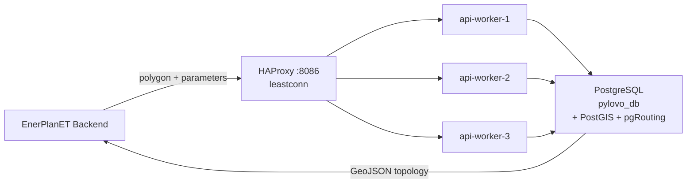

# PyLovo Grid Engine

PyLovo (PYthon tool for LOw-VOltage distribution grid generation) generates synthetic low-voltage distribution grids from OpenStreetMap building data.

## Overview

PyLovo is integrated into EnerPlanET as a FastAPI microservice. It receives a GeoJSON polygon from the EnerPlanET backend and returns a complete electrical network topology.

## Key Features (vs. original PyLovo)

| Feature | Description |
|---|---|
| REST API | FastAPI service for grid generation and management |
| Multi-country pipeline | OSM data acquisition for DE, NL, AT, ES, CZ |
| Extended f_class | 150+ building types from OSM |
| AI Energy Estimation | Stromspiegel 2025 + DIN 18015 peak sizing |
| pgRouting cable routing | Building-to-transformer cables follow the road network |
| User-placed transformers | Add, move, delete via API; isolated per model (`draft_id` / `model_id`) |
| Multi-building assignment | Assign multiple buildings to a transformer in one operation |
| MV line generation | Synthetic medium-voltage lines via minimum spanning tree |

## Supported Regions

| Country | Key | Data Source |
|---|---|---|
| Germany | `germany` | Postcode boundaries (included) |
| Netherlands | `netherlands` | CBS (Statistics Netherlands) + PDOK |
| Austria | `austria` | GADM Level 2 districts |
| Spain | `spain` | OpenDataSoft |
| Czech Republic | `czech_republic` | OpenDataSoft |

## Citation

> Reveron Baecker et al. (2025): *Generation of low-voltage synthetic grid data for energy system modeling with the pylovo tool*. Sustainable Energy, Grids and Networks. [doi:10.1016/j.segan.2024.101617](https://doi.org/10.1016/j.segan.2024.101617)
