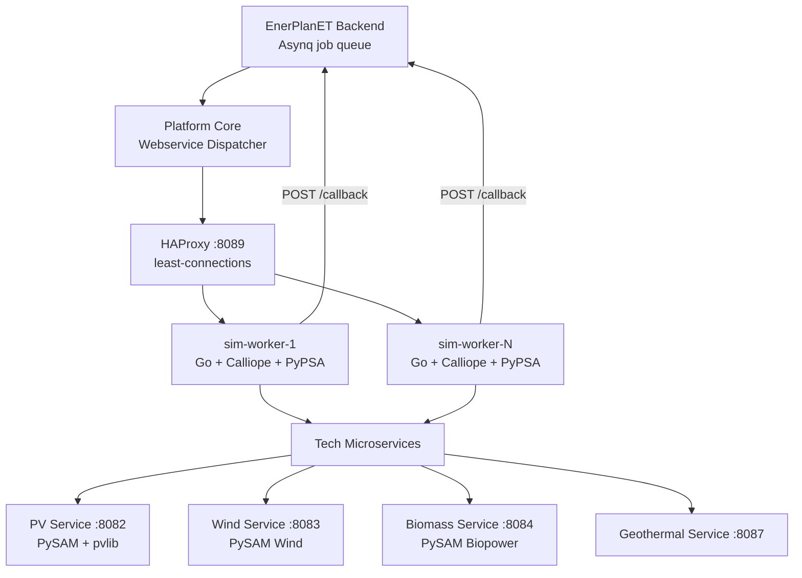
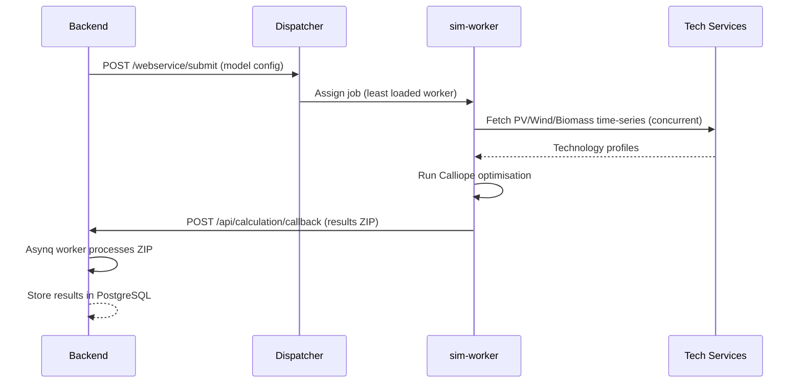

# Simulation Webservice

The simulation webservice manages energy system calculations for EnerPlanET models. It dispatches jobs to Calliope and PyPSA workers and coordinates technology-specific microservices.

## Architecture



Workers share a Docker volume (`sim_shared_data`) for model input/output files under `data/{model_id}/`.

## Simulation Engines

| Engine | Use Case |
|---|---|
| **Calliope 0.6.10** | Energy system optimisation (primary) |
| **PyPSA** | Power system analysis (optional) |

## API Endpoints

| Endpoint | Description |
|---|---|
| `POST /calliope/run` | Submit a Calliope optimisation job |
| `POST /pypsa/run` | Submit a PyPSA analysis job |
| `GET /calliope/status/{job_id}` | Get job status |
| `POST /csv2json/convert` | Convert CSV results to JSON |
| `POST /charging/simulate` | EV charging optimisation |
| `GET /health` | Service health check |

## Job Lifecycle



## Configuration

Workers are controlled by environment variables:

```bash
MAX_CONCURRENT=10           # Simultaneous jobs per worker
CALLIOPE_TIMEOUT=3600       # Job timeout in seconds
SHARED_DATA_PATH=/data      # Shared volume mount point
BACKEND_CALLBACK_URL=http://energy-backend:8000/api/v1/calculation/callback/
```

## Scaling

Add more simulation workers by increasing the replica count in `docker-compose.yml`:

```yaml
services:
  sim-worker:
    image: ${WEBSERVICE_IMAGE}
    deploy:
      replicas: 3
    environment:
      MAX_CONCURRENT: 10
```

HAProxy automatically distributes jobs using least-connections load balancing.
