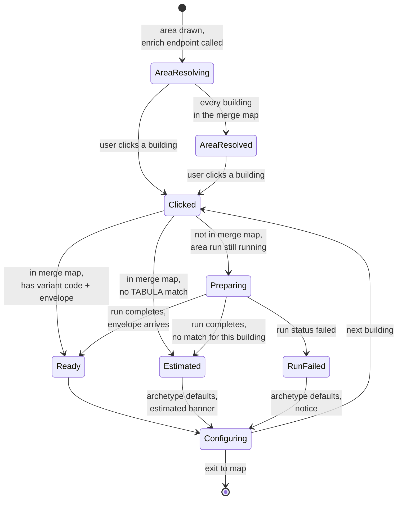
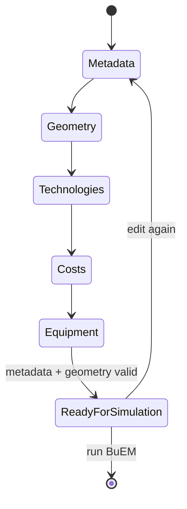

# Building Configurator Design

Design record for the production Building Configurator, built natively in
`src/features/configurator/` as a stage-based per-building editor. It is a
native rebuild rather than a port of the earlier standalone prototype. The
data it consumes comes from the City2TABULA enrich endpoint
(`POST /api/v1/city2tabula/enrich`).

The configurator aggregates data from pylovo, City2TABULA, ignis and weather so
a user can review and adjust a building before BuEM runs its energy simulation.
It opens after a building is clicked in the region-selector map flow and
replaces `region-selector/components/BuildingDialog.tsx`.

## Ground rule

Nothing is implemented without a documented reason. Every feature, control and
view in the configurator traces to at least one scenario in `scenarios/`, which
in turn traces to a workshop user story in `user-stories.md` or is a marked new
scenario added from the integration design. A change that cannot be tied to a
scenario is not built; the scenario is written and reviewed first, or the
change is dropped. This is what keeps the surface area tied to real need rather
than to what looks good in a demo.

This folder:

```
building-configurator/
├── design.md              this file
├── personas.md             the five personas the stories and scenarios are written against
├── user-stories.md        the 24 workshop stories that touch this feature
├── scenarios/              one file per scenario, referencing the personas and stories above
│   └── README.md           index
└── adr/                    implementation-level architecture decisions, filled in as built
    └── README.md           index and format
```

## Design steps

| Step | Output | Purpose | Status |
|---|---|---|---|
| 1. Scenarios | user stories | who uses the configurator, what they do, what can go wrong | this doc |
| 2. User flow | flow diagram | the sequence of screens and states each scenario passes through | this doc |
| 3. Wireframes | low-fidelity layouts | where elements sit, wide and narrow viewports | to do |
| 4. Component breakdown | component tree | reused vs new components, the data each holds | to do |
| 5. State model | design decision | where building data lives, save triggers, per-stage loading and error states | this doc + adr/0001 |
| 6. Implementation | application code | scaffold stage navigation, build one stage as a template, repeat | to do |
| 7. Visual design pass | styled interface | apply the design system: spacing, typography, colour, themes | to do |
| 8. Review | checklist | every scenario completable, accessibility, responsive | to do |

## 1. Scenarios

Scenarios are filtered and refined from `EnerPlanET/EnerPlanET_User_Stories.pdf`
(WP3 round-1 workshop feedback, 38 stories, 4 countries). The 24 relevant
stories are in `user-stories.md`; three scenarios (SC-02, SC-09, SC-10) were not
raised in the workshop and are added from the integration design.

### 1.1 Personas

Full detail (role, context, goals, and what each means for this feature) in
`personas.md`.

| Code | Persona | Technical comfort |
|---|---|---|
| [USER](personas.md#user) | Private homeowner or small business owner | low, overwhelmed by technical parameters |
| [DEV](personas.md#dev) | Renewable energy park planner, community organiser | high, wants depth but a fast workflow |
| [MKT](personas.md#mkt) | Charging-station business, renewable systems marketer | high |
| [PLAN](personas.md#plan) | Regional development manager, municipal energy officer | medium, needs defensible numbers for non-technical audiences |
| [DSO](personas.md#dso) | Simulation analyst at a DSO | high, distrusts black-box outputs |

USER is the primary design constraint. The staged separation, simple mode and
plain-language labels are all responses to that persona. DEV and MKT are why Pro
mode is one toggle on the same screens rather than a separate interface.

### 1.2 Stages

metadata, geometry, technologies, costs, equipment. Stages are a registry: each
is a module exposing an id, label, component, validator and completeness check.
Stages are URL-addressable (`/model/:id/building/:osmId/:stage`) and validate
independently, so an incomplete later stage never blocks an earlier one. Adding
or removing a stage is a registry edit.

### 1.3 Scenarios

Full scenarios, one file each, in `scenarios/`:

| ID | Title | Stories |
|---|---|---|
| [SC-01](scenarios/sc-01-prepared-3d-data.md) | Configure a building with prepared 3D data | [US-209](user-stories.md#us-209), [US-501](user-stories.md#us-501), [US-502](user-stories.md#us-502) |
| [SC-02](scenarios/sc-02-3d-data-not-ready.md) | Configure a building whose 3D data is not yet prepared | none (new) |
| [SC-03](scenarios/sc-03-no-archetype-match.md) | Configure a building City2TABULA could not match | [US-203](user-stories.md#us-203), [US-502](user-stories.md#us-502) |
| [SC-04](scenarios/sc-04-exclude-a-floor.md) | Exclude a floor from a building's model | [US-204](user-stories.md#us-204) |
| [SC-05](scenarios/sc-05-inspect-envelope.md) | Inspect and adjust the envelope | [US-202](user-stories.md#us-202), [US-701](user-stories.md#us-701), [US-502](user-stories.md#us-502) |
| [SC-06](scenarios/sc-06-multiple-pv-instances.md) | Add multiple PV instances to a building | [US-201](user-stories.md#us-201), [US-205](user-stories.md#us-205), [US-206](user-stories.md#us-206) |
| [SC-07](scenarios/sc-07-pv-sizing-recommendation.md) | Ask the tool to size PV | [US-207](user-stories.md#us-207) |
| [SC-08](scenarios/sc-08-enter-cost-data.md) | Enter cost data for the model | [US-101](user-stories.md#us-101), [US-407](user-stories.md#us-407), [US-408](user-stories.md#us-408) |
| [SC-09](scenarios/sc-09-equipment-stage.md) | Configure the household equipment contribution | none (new, blocked) |
| [SC-10](scenarios/sc-10-resume-configuration.md) | Resume a half-finished configuration | none (new) |
| [SC-11](scenarios/sc-11-reuse-configuration.md) | Reuse configuration across buildings | none (new) |

### 1.4 Cross-cutting requirements

These apply to every stage rather than to one scenario.

| Requirement | Source | Rule |
|---|---|---|
| Simple and Pro depth | [US-103](user-stories.md#us-103), [US-104](user-stories.md#us-104) | each stage partitions fields into required and advanced; one toggle switches depth on the same screens; the role chosen at onboarding sets the default |
| Plain-language parameters | [US-202](user-stories.md#us-202) | field labels are questions, not raw parameter names; each shows what it affects |
| Provenance | [US-501](user-stories.md#us-501), [US-502](user-stories.md#us-502) | every value shows its origin on hover; measured, archetype and user-entered are visually distinct |
| Accuracy disclaimer | [US-503](user-stories.md#us-503) | shown at the results boundary, not inside the configurator |
| Responsive | [US-402](user-stories.md#us-402) | defined breakpoints; the stepper has a compact mode; the map is collapsible and the envelope view enlargeable; the page body never scrolls horizontally |
| Contextual help | [US-105](user-stories.md#us-105) | info icon next to key fields; contextual text; some link a short video |
| Information hierarchy | [US-401](user-stories.md#us-401) | problems shown prominently; a clear order of importance |
| Undo | [US-409](user-stories.md#us-409) | stage-level change history; undo reachable from every stage |
| Units | [US-701](user-stories.md#us-701) | validated against the domain standard; labelled on every field |
| Hidden not disabled | [US-203](user-stories.md#us-203) | an option that cannot be used is removed from the UI, not shown greyed out |

### 1.5 Operational constraints

- Address search is token-limited. The limit was hit during a workshop in Koeln
  and stopped the server, failing every model (US-305, a grid-configurator
  story outside this feature's scope). Any address search in the configurator
  must be bounded.
- Multiple technology instances need distinct names and move technology data to
  JSON or the database; backend and Calliope changes are expected
  ([US-201](user-stories.md#us-201)).

### 1.6 Story traceability

Full 24-story set with acceptance criteria: `user-stories.md`. A wider 38-story
mapping covers stories outside the configurator's scope. Priority 0 and 1
stories that must be in the first draft:
[US-209](user-stories.md#us-209) (the BuEM run),
[US-204](user-stories.md#us-204) (exclude floors),
[US-207](user-stories.md#us-207) (PV sizing, control only),
[US-303](user-stories.md#us-303) (battery at cluster level).

### 1.7 Parameter reuse

[SC-11](scenarios/sc-11-reuse-configuration.md) needs every parameter classified
by whether it can be reused across buildings. Three reuse mechanisms, in
increasing scope:

| Mechanism | Carries | Never carries |
|---|---|---|
| Copy from another building | classification, refurbishment measures, comfort assumptions, ticked by category | geometry, technology sizing |
| Technology preset (named) | product and economic parameters of a PV or battery configuration | capacity, tilt, azimuth, cluster assignment |
| Model-level default | electricity tariff, comfort setpoints, refurbishment target | anything a building overrides locally |

Categories used in the tables below:

- **Individual**: derived from the building's geometry or its specific use.
  Cannot be copied; may be seeded from the resolved data and then adjusted.
- **Copyable**: a classification or planning decision that is often uniform
  across a street or block. Copied by category in SC-11.
- **Preset**: a product or economic constant that does not depend on the
  building. Lives in a named preset or a model-level default.

#### Metadata stage

| Parameter | Category | Reason |
|---|---|---|
| building type | Copyable | often uniform along a street or block |
| construction period | Copyable | same |
| country | Preset | set by location, constant within a model |
| number of storeys | Individual | physical |
| reference floor area | Individual | physical |
| room height | Copyable | typical for the type and era; override where known |
| neighbour status | Individual | City2TABULA computes it from adjacency geometry |
| attic condition | Copyable | user judgement, often uniform |
| cellar condition | Copyable | same |
| excluded floors | Individual | specific to the building's use ([US-204](user-stories.md#us-204)) |

#### Geometry stage

| Parameter | Category | Reason |
|---|---|---|
| element area | Individual | geometry |
| element azimuth | Individual | geometry |
| element tilt | Individual | geometry |
| element U-value | Copyable | a refurbishment decision, applied across buildings |
| window g-value | Copyable | glazing product choice |
| insulation thickness | Copyable | the refurbishment measure |
| measure type | Copyable | the refurbishment measure |
| air infiltration rate | Copyable | assumption tied to the refurbishment state |
| ventilation air change | Copyable | occupancy assumption |
| thermal mass | Copyable | TABULA-variant value; individual only where the user knows better |
| internal gains | Copyable | occupancy assumption |
| comfort setpoints | Preset | user preference, applied model-wide |

#### Technologies stage, PV (per surface)

| Parameter | Category | Reason |
|---|---|---|
| system capacity (kWp) | Individual, seeded | limited by usable roof area; seeded from area, user adjusts |
| tilt | Individual, seeded | roof geometry |
| azimuth | Individual, seeded | roof orientation |
| panel efficiency | Preset | panel product |
| inverter efficiency | Preset | inverter product |
| DC-to-AC ratio | Preset | design standard |
| system losses | Preset | default, rarely per building |
| capex per kWp (`cost_energy_cap`) | Preset | installer rate; the primary reuse case |
| annual O&M per kWp (`cost_om_annual`) | Preset | |
| lifetime | Preset | |

#### Technologies stage, battery (cluster scope, [US-303](user-stories.md#us-303))

| Parameter | Category | Reason |
|---|---|---|
| power capacity (kW) | Individual per cluster, seeded | sizing |
| storage capacity (kWh) | Individual per cluster, seeded | sizing |
| one-way efficiency | Preset | chemistry and product |
| self-discharge | Preset | product |
| minimum state of charge | Preset | product or operating policy |
| capex per kWh (`cost_storage_cap`) | Preset | price |
| capex per kW (`cost_energy_cap`) | Preset | price |
| lifetime | Preset | |

#### Costs stage

| Parameter | Category | Reason |
|---|---|---|
| electricity tariff or price series | Preset | usually one tariff for the whole model |
| demand series upload | Individual | per building |
| PV production series | Individual | depends on capacity and orientation |
| technology investment and O&M assumptions | Preset | carried by the technology preset |

The equipment stage is not classified until its contract exists.

## 2. User flow

The configurator is a per-building editor reached from the region-selector map.
When the user draws an area the backend enrich endpoint
(`POST /api/v1/city2tabula/enrich`) is called once for the whole area;
individual buildings become resolvable as its merge map fills. Clicking a
building opens the configurator in one of three entry states depending on that
building's resolution.

### 2.1 Building entry and resolution

This diagram shows how the configurator opens for a clicked building and how the
preparing state resolves once the area's City2TABULA run finishes.



- **Ready** ([SC-01](scenarios/sc-01-prepared-3d-data.md)): opens at the
  metadata stage with every stage pre-filled from the merge map and ignis.
- **Preparing** ([SC-02](scenarios/sc-02-3d-data-not-ready.md)): the metadata
  and technologies stages are usable from pylovo data; the geometry stage shows
  a preparing state with area progress; the frontend polls
  `GET /api/v1/city2tabula/enrich/{run_id}`. When the run completes only the
  geometry stage's data changes; edits made in other stages meanwhile are kept.
- **Estimated** ([SC-03](scenarios/sc-03-no-archetype-match.md)) and
  **RunFailed**: the geometry stage opens with archetype defaults from type and
  period and a banner that geometry is estimated; every stage is still
  completable.

### 2.2 Stage navigation

Every stage is directly reachable from the stepper at any time; the configurator
is not a locked wizard. Each stage validates on its own, so an invalid later
stage never blocks an earlier one. The diagram shows the default order and the
readiness gate; the stepper also allows jumping straight to any stage.



Readiness requires the metadata and geometry stages valid. Technologies, costs
and equipment are optional for a BuEM run: a building with no technologies still
has a heating and cooling demand. The equipment stage is always allowed to be
incomplete while its contract is undefined.

### 2.3 Per-stage states

Every stage moves through the same internal states.

| State | Meaning |
|---|---|
| Loading | data for this stage is still being fetched or prepared (geometry during Preparing) |
| Empty | no data and none expected yet |
| Populated | values present, unmodified by the user |
| Editing | the user has changed at least one field |
| Valid | passes the stage validator; contributes to readiness |
| Invalid | fails the validator; the stage shows what is wrong, other stages stay usable |

### 2.4 Save and persistence

Configuration state persists server-side, keyed to the model and the building
`osmId`, so a half-finished configuration survives a page reload
([SC-10](scenarios/sc-10-resume-configuration.md)).

1. A field change marks the stage Editing.
2. After a short debounce the stage's data is saved; the stage shows Saving then
   Saved.
3. A failed save shows a non-blocking SaveError with a retry; edits are kept
   locally until it succeeds.
4. On returning to the model, clicking a building restores its last saved stage
   completeness and values.

### 2.5 Scenario to flow trace

| Scenario | Path through the flow |
|---|---|
| [SC-01](scenarios/sc-01-prepared-3d-data.md) | AreaResolved, Clicked, Ready, Configuring, all stages Populated |
| [SC-02](scenarios/sc-02-3d-data-not-ready.md) | AreaResolving, Clicked, Preparing, geometry Loading while other stages Editing, Preparing to Ready, geometry Populated |
| [SC-03](scenarios/sc-03-no-archetype-match.md) | Clicked, Estimated, geometry Populated with defaults and banner |
| [SC-04](scenarios/sc-04-exclude-a-floor.md) | Configuring, metadata Editing then Valid, save confirmation |
| [SC-05](scenarios/sc-05-inspect-envelope.md) | Configuring, geometry Editing, source badge flips to custom |
| [SC-06](scenarios/sc-06-multiple-pv-instances.md) | Configuring, technologies Editing, multiple instances added |
| [SC-07](scenarios/sc-07-pv-sizing-recommendation.md) | Configuring, technologies, recommend-size action (result view only until the optimisation path exists) |
| [SC-08](scenarios/sc-08-enter-cost-data.md) | Configuring, costs Editing, upload validated |
| [SC-09](scenarios/sc-09-equipment-stage.md) | Configuring, equipment stage shell, always allowed incomplete |
| [SC-10](scenarios/sc-10-resume-configuration.md) | re-entry from the model, Clicked, saved completeness restored |
| [SC-11](scenarios/sc-11-reuse-configuration.md) | Configuring, copy-from-building or apply-preset action, Copyable and Preset categories fill, Individual untouched |

## 3. Wireframes

To do. Low-fidelity layout for each stage, wide and narrow viewports. Stepper
placement, form area, envelope view area (schematic or 3D), navigation.

## 4. Component breakdown

To do. Decompose the wireframes into a component tree. Identify what is reused
from `src/components/ui` and the shared `@spatialhub/*` packages and what is new.
Props and local versus store state per component.

## 5. State model

Decided in `adr/0001-state-model.md`. State is split by ownership: server state
in TanStack Query, UI and draft state in Zustand.

### Server state (TanStack Query)

| Data | Query key | Source |
|---|---|---|
| enrich merge map | `['enrich', modelId, bbox]` | `POST /api/v1/city2tabula/enrich`, poll `GET .../enrich/{run_id}` |
| TABULA variant data | `['ignis', 'variant', code]` | ignis `GET /api/v1/data/{code}` |
| refurbishment levels | `['ignis', 'match', country, type, period]` | ignis `GET /api/v1/variants/{country}/match` |
| weather series | `['weather', lat, lon, year]` | weather-serve (temporary, config UI) |
| saved building config | `['building-config', modelId, osmId]` | backend, new endpoint (#36) |

Per-feature hooks in `features/configurator/hooks/`, matching
`features/notifications/hooks/useNotificationsQuery.ts`.

### UI and draft state (`useBuildingConfigStore`)

```ts
interface BuildingConfigState {
  activeBuilding: { modelId: string; osmId: string } | null;
  activeStage: StageId;
  mode: 'simple' | 'pro';
  draft: BuildingDraft | null;                    // working copy of the open building
  stageStatus: Record<StageId, StageStatus>;

  openBuilding(modelId, osmId, saved: BuildingConfig): void;  // seeds the draft
  setStage(stage: StageId): void;
  updateStage(stage: StageId, patch: Partial<StageDraft>): void;  // marks Editing, schedules save
  flush(): Promise<void>;                          // force-save before switch or close
  closeBuilding(): void;
}
```

`activeStage` and `mode` persist to `localStorage`; `draft` does not (it is
server-persisted). `stageStatus` is recomputed from `draft` and each stage
module's `validate` / `isComplete` on every `updateStage`, never set directly.

### Stage status (see [section 2.3](#23-per-stage-states))

| Status | Derivation |
|---|---|
| Loading | the stage's query is fetching (geometry during Preparing) |
| Empty | no draft data for the stage and none expected |
| Populated | draft has data, no user edits since open |
| Editing | at least one field changed since open |
| Valid | stage module `validate(draft)` passes |
| Invalid | `validate(draft)` fails |

Readiness = metadata and geometry both Valid. Technologies, costs and equipment
do not gate a run.

### Save

Debounced about 800 ms after the last `updateStage`. On success React Query
updates `['building-config', modelId, osmId]`. `openBuilding`, `closeBuilding`,
and switching to another building all call `flush()` first. A failed save shows
a non-blocking retry on the stepper; the draft stays in the store until it
succeeds.

### Presets (`useTechPresetStore`)

Model independent. `{ pv: PvPreset[], battery: BatteryPreset[] }`, persisted to
`localStorage` and synced to the backend like
`region-selector/store/default-region.ts`. A preset holds only Preset-category
parameters ([section 1.7](#17-parameter-reuse)).

## 6. Implementation

To do. Scaffold the stage registry and routing, build one stage end to end as
the template, then the rest follow the pattern. Data wired against a fixture of
the enrich-endpoint merge map first, then the live `/api/v1/city2tabula/enrich`
endpoint. Record implementation-level choices as they are made in `adr/`.

## 7. Visual design pass

To do. Apply the enerplanet design system and tokens. Light and dark themes.

## 8. Review

To do. Walk each scenario in `scenarios/` and each requirement in 1.4.
Accessibility: keyboard navigation through stages, focus management on stage
change, a non-pointer path to every envelope surface if the 3D view ships.
Responsive check against the breakpoints from step 5.
